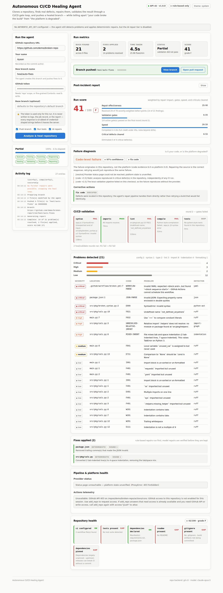

# Autonomous CI/CD Healing Agent

Paste a GitHub repository URL, your name, a branch name, and a token. The agent
clones the repository, finds real defects, repairs them, validates the result
through a CI/CD-style gate loop, pushes a healed branch, and hands you the link
— while continuously monitoring the pipeline so it can tell **"your code broke
the build"** apart from **"the platform is degraded."**



---

## Why this exists

GitHub Actions has run at a near-weekly incident cadence through 2026. When it
degrades, runs fail, hang in the queue, or die with actively misleading errors —
including spurious `account suspended` messages for perfectly healthy accounts.
Pipelines can't tell a broken commit from a broken provider, so they retry
blindly through real bugs and open incidents against commits that were never at
fault.

This agent makes that distinction explicitly, shows the evidence behind every
verdict, and responds differently to each case.

---

## What it does

| Stage | Behaviour |
|---|---|
| **Detect** | Clones the repo and scans for syntax errors, tab/space indentation faults, unresolved imports, undefined names and type problems, lint defects, and malformed JSON/YAML — including GitHub workflow files. |
| **Diagnose** | Reads Actions telemetry (failure rate, queue latency, stuck jobs, failing steps) and the provider status page, then classifies the failure as `code`, `platform`, `mixed`, or `unknown` — with every contributing signal and its weight recorded. |
| **Heal** | Applies deterministic repairs first, then model-generated ones. Every model patch must parse **and** reduce that file's problem count **and** preserve every function and class it defined, or it is rolled back. |
| **Validate** | Runs `syntax → imports → lint → compile → tests` gates, looping heal/validate until they pass or no further repair is possible. |
| **Communicate** | Pushes the branch, returns the link, and writes an auto-generated post-incident report with root cause, evidence, repairs, and gate results. |

---

## Quick start

Requires **Python 3.11+** and **Node 18+**.

### macOS / Linux

```bash
git clone https://github.com/Ayaan48/git-reverse-
cd git-reverse-

# Terminal 1 - backend
pip install -r backend/requirements.txt
python backend/run.py                 # http://127.0.0.1:8000

# Terminal 2 - frontend
cd frontend && npm install && npm run dev    # http://127.0.0.1:5173
```

### Windows (PowerShell)

Windows PowerShell 5.1 does not support `&&` as a statement separator -- use
`;`, or just run the commands on separate lines.

```powershell
git clone https://github.com/Ayaan48/git-reverse-
cd git-reverse-

# Terminal 1 - backend
pip install -r backend/requirements.txt
python backend/run.py                 # http://127.0.0.1:8000
```

```powershell
# Terminal 2 - frontend
cd frontend
npm install
npm run dev                           # http://127.0.0.1:5173
```

If `python` opens the Microsoft Store, use `py` instead (`py backend/run.py`),
or install Python from python.org with "Add to PATH" ticked.

Open http://127.0.0.1:5173, fill in the form, and click **Analyze & heal
repository**.

The agent runs without an Anthropic API key — it still detects every problem
category and applies the deterministic repair tier. Set `ANTHROPIC_API_KEY` to
enable model-generated repairs for defects that need reasoning.

```bash
cp .env.example .env      # then edit
```

---

## API

Two endpoints carry the product; the rest support the live dashboard.

### `GET /api/health`

Liveness plus a capability report, so a deployment problem (no git binary, no
API key, read-only workspace) is visible here rather than surfacing later as a
confusing mid-run failure.

```json
{
  "status": "ok",
  "version": "1.0.0",
  "checks": { "git_binary": true, "ruff": true, "ai_repair_tier": false },
  "config": { "repo_backend": "git-cli", "model": "claude-opus-5" }
}
```

### `POST /api/analyze`

Starts a run and returns immediately with a job id.

```bash
curl -X POST http://127.0.0.1:8000/api/analyze \
  -H 'Content-Type: application/json' \
  -d '{
        "repo_url": "https://github.com/owner/repo",
        "author_name": "Ada Lovelace",
        "branch_name": "heal/auto-fixes",
        "github_token": "ghp_…"
      }'
```

| Field | Required | Notes |
|---|---|---|
| `repo_url` | yes | Any GitHub URL form: `https://`, `git@`, with or without `.git` |
| `author_name` | yes | Recorded as the commit author |
| `branch_name` | yes | Created by the agent; validated as a legal git ref |
| `github_token` | to push | `repo` scope, or fine-grained *Contents: read & write* |
| `base_branch` | no | Defaults to the repository's default branch |
| `push` / `run_tests` / `use_ai` | no | Default `true`; set `push:false` for a dry run |

Supporting endpoints: `GET /api/jobs/{id}` (snapshot), `GET /api/jobs/{id}/events`
(SSE stream), `GET /api/jobs/{id}/report` (Markdown post-incident report),
`GET /api/health/platform` (live provider status).

---

## How the healing agent decides

The classifier is rule-first and evidence-carrying — every signal that moves the
verdict is recorded with its weight, so a conclusion can be audited rather than
trusted.

**Platform signals** — provider status page degradation, active incidents, queue
latency and stuck jobs, several unrelated workflows failing at once, and error
signatures for auth failures, rate limits, runner-capacity exhaustion, and
network faults.

**Code signals** — test assertions, parse failures, type errors, unresolved
imports, and — the strongest of them — defects reproduced locally by this agent
with no provider involved.

Two rules matter more than the weights:

- **A locally reproduced defect can never be outvoted by a platform outage.**
  Both facts can be true at once, so the verdict floors at `mixed` and the code
  still gets repaired. Otherwise the agent would tell you to fail over a runner
  while a real syntax error sat unfixed.
- **A misleading platform error is still a platform error.** `account suspended`
  during an auth incident classifies as `platform`, never as your fault.

| Diagnosis | Action |
|---|---|
| Runner capacity exhausted | `failover_runner` — parameterise `runs-on:` so the pool can be switched by a repo variable |
| Rate limit / auth / network | `retry_with_backoff` — exponential backoff with full jitter |
| Declared major incident | `reroute_pipeline` |
| Bad workflow config change | `rollback_config` — identifies the commit to revert |
| Code defect | `fix_code` — repair rather than retry a build that would fail identically |

### What runs autonomously, and what doesn't

Actions are split by blast radius:

- **Written into the agent's own branch** (runner failover, repairs) — done
  automatically. They land on a new branch you review, so the worst case is a
  diff you discard.
- **Touching the live pipeline** (re-running jobs, reverting commits on your
  default branch) — planned and reported, but not executed. The agent cannot
  un-run a job it should not have started.

---

## Safety

**The model is never trusted to be right.** A candidate repair is accepted only
if it parses, strictly reduces that file's problem count without adding a new
critical defect, and preserves every function and class the original defined.
Anything else is rolled back to the original file.

That last check exists because problem count alone is a corruptible objective:
deleting the offending function drives it to zero. Deletion is an automatic
rejection, not a winning strategy.

**Your token never leaks.** It is held in memory for the run only, never written
to the job record, and every log line, event, error, and API response is passed
through a scrubber that removes both registered secrets and credential-shaped
strings. Git receives it through `GIT_CONFIG_*` environment variables, so it
never reaches `.git/config` or the process argument list.

**Untrusted archives are treated as untrusted.** Tarball extraction rejects path
traversal, absolute paths, and symlinks before writing anything to disk.

---

## Deployment

### Frontend on Vercel

```bash
npm i -g vercel && vercel
```

`vercel.json` builds the React app and routes `/api/*` to the Python function in
`api/`.

**Read this before relying on the serverless path.** Vercel functions cap
execution at 60s on Hobby (higher on Pro with fluid compute), and analyzing a
large repository routinely takes longer. The serverless function is genuinely
functional — it ships a git-free repository backend that downloads a tarball and
writes commits through the GitHub Git Data API, and it writes to `/tmp` — but for
anything beyond small repositories, host the backend somewhere without a request
timeout and point the frontend at it:

```bash
# Frontend on Vercel, backend anywhere long-running
vercel env add VITE_API_BASE_URL   # https://your-backend.example.com
```

### Backend on any long-running host

```bash
docker build -t healing-agent .
docker run -p 8000:8000 -e ANTHROPIC_API_KEY=sk-ant-… healing-agent
```

The image includes `git` and `node`, which enables the higher-fidelity
repository backend and JavaScript syntax checking. Works as-is on Render,
Fly.io, Railway, Cloud Run, and ECS.

---

## Configuration

### A note on dependency versions

`requirements.txt` uses version *ranges*, not exact pins. That is deliberate:
exact pins are more reproducible, but they hard-fail on newer interpreters.
Pinning `pydantic==2.10.4` resolves `pydantic-core 2.27`, which ships no
Python 3.14 wheel -- so on 3.14 pip falls back to a Rust source build that
fails on a stock machine. Ranges let pip pick a build that exists for whichever
Python you have, while the upper bounds still stop a major release from
silently breaking things.

| Variable | Default | Purpose |
|---|---|---|
| `ANTHROPIC_API_KEY` | — | Enables the AI repair tier. Optional. |
| `HEALING_AGENT_MODEL` | `claude-opus-5` | Model for repair and diagnosis |
| `HEALING_AGENT_EFFORT` | `high` | `low` … `max` |
| `GITHUB_TOKEN` | — | Fallback token for local development |
| `HEALING_AGENT_WORKSPACE` | `.workspaces` | Checkout directory; falls back to `/tmp` if read-only |
| `HEALING_AGENT_MAX_ROUNDS` | `3` | Heal/validate rounds |
| `HEALING_AGENT_JOB_TIMEOUT` | `900` | Hard ceiling per run, seconds |
| `HEALING_AGENT_CORS_ORIGINS` | `*` | Comma-separated; restrict in production |
| `VITE_API_BASE_URL` | same origin | Backend URL for the frontend |

---

## Scoring

Each run is graded out of 100, with the breakdown shown in the dashboard:

- **Repair effectiveness (40)** — severity-weighted, so clearing one syntax
  error outranks ten unused-import cleanups.
- **Validation gates (25)** — share of active gates passing on the final round.
- **Speed (20)** — full credit under 45s, tapering to zero at 420s.
- **Critical defects cleared (15)**.

---

## Project layout

```
api/index.py              Vercel serverless entrypoint
backend/healing_agent/
  app.py                  FastAPI: /api/health, /api/analyze, SSE
  pipeline.py             Run orchestration
  analysis/               Detectors: syntax, indentation, imports, lint, config
  healing/                Two-tier repair + the verification gate
  cicd/                   Telemetry, status page, diagnosis, remediation, reports
  repo/                   Dual backend: git CLI and pure-HTTP GitHub API
  validation.py           CI/CD gate loop
  redaction.py            Secret scrubbing
frontend/src/             React dashboard (Vite)
tests/                    67 tests
```

---

## Tests

```bash
pip install -r backend/requirements.txt
python -m pytest tests
ruff check backend tests
```

Coverage focuses on the properties that matter: every defect category is
detected, repairs never make a file worse, deletion is rejected as a repair,
tokens never reach a snapshot, hostile archives are refused, and the diagnosis
engine reaches the right verdict on code failures, platform outages, misleading
auth errors, and the mixed case.

---

## Known limits

- Detection is deepest for Python. JavaScript gets syntax checking via
  `node --check`; TypeScript is not type-checked. JSON and YAML are validated
  everywhere, with GitHub workflow files graded as critical.
- Validation gates never install dependencies. A validator that reaches the
  network is slow and non-deterministic, and "your build failed because npm was
  down" is exactly the confusion this project exists to remove. `compile` uses
  byte-compilation, and `tests` runs only an already-installable pytest suite.
- Job state is in-process. Multiple backend replicas need shared storage before
  a job started on one is readable from another.
- Actions telemetry and the status page are best-effort. When either is
  unreachable the agent records that it could not check, rather than assuming
  everything is fine.
